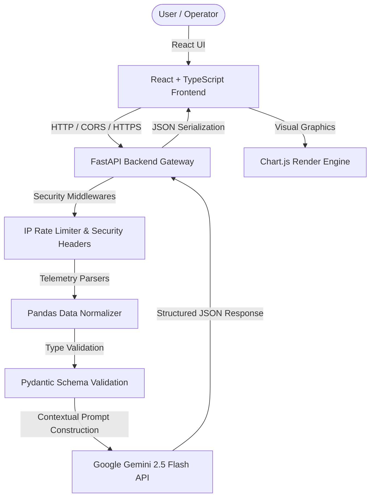
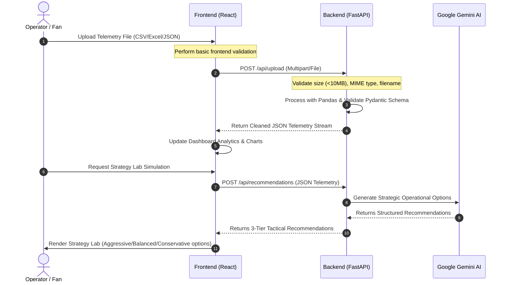

# ArenaMind AI 🏟️

[](#)
[](LICENSE)
[](#)
[](#)
[](#)
[](#)

**The Autonomous Decision Intelligence Platform for FIFA World Cup 2026 Operations.**

ArenaMind AI transforms complex stadium telemetry into actionable, executive-level decision intelligence. It is a premium digital twin platform designed specifically to optimize crowd dynamics, volunteer deployment, security, and accessibility for large-scale mega-events.

---

## 📖 Table of Contents

- [Problem Statement](#-problem-statement)
- [Solution Overview](#-solution-overview)
- [Key Features](#-key-features)
- [Architecture](#-architecture)
- [Application Workflow](#-application-workflow)
- [Tech Stack](#-tech-stack)
- [Folder Structure](#-folder-structure)
- [Installation Guide](#-installation-guide)
- [Environment Variables](#-environment-variables)
- [API Documentation](#-api-documentation)
- [Security Hardening](#-security-hardening)
- [Accessibility Compliance](#-accessibility-compliance)
- [Performance Optimizations](#-performance-optimizations)
- [Testing Strategy](#-testing-strategy)
- [Deployment](#-deployment)
- [Screenshots & Demo](#-screenshots--demo)
- [Future Roadmap](#-future-roadmap)
- [Challenges & Lessons Learned](#-challenges--lessons-learned)
- [License](#-license)

---

## ❓ Problem Statement

Large-scale sporting events like the **FIFA World Cup 2026** face critical challenges in real-time stadium operations:
- **Crowd Congestion:** Unmanaged crowd flow leading to bottlenecks at stadium gates.
- **Resource Misallocation:** Inefficient dispatch of volunteers and emergency teams.
- **Data Silos:** Telemetry data (crowd size, weather, active incidents, language distributions) exists in isolation.
- **Accessibility Bottlenecks:** Real-time visibility into gates with special accessibility constraints or pending assistance requests is often manual or delayed.

---

## 💡 Solution Overview

ArenaMind AI connects raw stadium telemetry with an LLM reasoning engine to create an operational digital twin:
- **Centralized Telemetry Ingres:** Real-time ingestion and validation of stadium sensor, volunteer, and gate telemetry.
- **Predictive Bottleneck Analysis:** Calculates an operational "Readiness Score" dynamically.
- **AI-Assisted Operations:** Generates multi-variant tactical plans (Aggressive, Balanced, Conservative) with complete explainability, expected recovery times, and historical precedents.

---

## 🌟 Key Features

1. **Executive Mission Control Dashboard:** A unified pane tracking Readiness Scores, gate capacities, active incidents, and volunteer distribution.
2. **AI MatchDay Companion:** Fan-facing virtual assistant answering localized queries (e.g. gates, accessibility options, current congestion).
3. **Operations Copilot:** Command-staff assistant to ask real-time operational questions.
4. **AI Strategy Lab:** Multi-scenario simulation engine producing immediate action items.
5. **Secure Telemetry Uploader:** Supports `.csv`, `.xlsx`, and `.json` telemetry files with strict server-side validation.

---

## 🏗 Architecture

ArenaMind AI utilizes a decoupled, modern digital twin architecture.



---

## 🔄 Application Workflow



---

## 💻 Tech Stack

| Category | Technologies |
| :--- | :--- |
| **Frontend** | React 18, TypeScript, Vite, Zustand, TailwindCSS, Framer Motion, Chart.js |
| **Backend** | Python 3.12, FastAPI, Pandas, Pydantic, Uvicorn |
| **AI Layer** | Google GenAI SDK (`gemini-2.5-flash` model mapping) |
| **Testing** | `pytest` (Backend), `Vitest` + `React Testing Library` (Frontend) |
| **CI/CD** | GitHub Actions |
| **Deployment**| Docker, Google Cloud Run |

---

## 📂 Folder Structure

```
├── .github/workflows/       # CI GitHub Actions
├── backend/
│   ├── app/
│   │   ├── api/            # API routing and upload endpoints
│   │   ├── core/           # Security headers and config
│   │   ├── schemas/        # Pydantic schema validation models
│   │   ├── services/       # Preprocessor and Gemini service layers
│   │   └── main.py         # FastAPI main entrypoint, CORS, Rate-Limiting
│   ├── tests/              # Pytest integration tests
│   ├── Dockerfile
│   └── requirements.txt
└── frontend/
    ├── src/
    │   ├── components/     # UI, layouts, and cards
    │   ├── lib/            # Utilities and cn tailwind helper
    │   ├── tests/          # Vitest and RTL component tests
    │   └── App.tsx
    ├── Dockerfile
    ├── nginx.conf
    └── vite.config.ts
```

---

## 🚀 Installation Guide

### Prerequisites
- Node.js 18+
- Python 3.12+
- Google Gemini API Key

### Manual Setup

1. **Clone the Repository**
   ```bash
   git clone https://github.com/avi-0707/ArenaMind-AI.git
   cd ArenaMind-AI
   ```

2. **Setup Backend**
   ```bash
   cd backend
   python -m venv venv
   source venv/bin/activate # Windows: venv\Scripts\activate
   pip install -r requirements.txt
   
   # Add your Gemini Key
   echo "GEMINI_API_KEY=your_key_here" > .env
   
   # Run local server
   uvicorn app.main:app --reload --host 127.0.0.1 --port 8000
   ```

3. **Setup Frontend**
   ```bash
   cd ../frontend
   npm install
   
   # Run development server
   npm run dev
   ```

---

## ⚙️ Environment Variables

### Backend Configuration (`backend/.env`)
- `GEMINI_API_KEY`: API authentication key for Gemini AI.
- `FRONTEND_URL`: CORS target URL (e.g. `https://arenamind-frontend-994969934794.us-central1.run.app`).

---

## 🔌 API Documentation

### 1. `GET /api/health`
- **Purpose:** Monitor service status.
- **Response Example:**
  ```json
  {"status": "ok", "message": "Backend is running"}
  ```

### 2. `POST /api/upload`
- **Purpose:** Parse and validate telemetry datasets.
- **Request:** `multipart/form-data` with `file` field.
- **Response Example:**
  ```json
  [
    {
      "timestamp": "10:00",
      "gate": "Gate A",
      "crowd_count": 8500,
      "incident_type": "Medical",
      "volunteers_available": 25,
      "weather": "Sunny",
      "language": "English"
    }
  ]
  ```

### 3. `POST /api/recommendations`
- **Purpose:** Generate 3-tiered operational strategies from telemetry data.
- **Request Body:** JSON array of `StadiumDataRow` elements.

---

## 🔒 Security Hardening

- **HTTP Security Headers:** Integrated custom middleware setting `X-Frame-Options: DENY`, `X-Content-Type-Options: nosniff`, `Referrer-Policy: strict-origin-when-cross-origin`, and `Content-Security-Policy`.
- **CORS Locks:** Restrains resource loading to verified production origins. Allowed headers and methods are restricted.
- **Upload Guards:** Upload size limit capped at **10MB**, and filenames are sanitized using `os.path.basename` to prevent directory traversal attacks.
- **Client IP Rate-Limiting:** Capped at 60 requests/minute per IP for sensitive AI endpoints.

---

## ♿ Accessibility Compliance

- **WCAG 2.2 AA Audited:**
  - Focus trapping and navigation trap restoration implemented inside all drawer configurations.
  - Full keyboard control for drag-and-drop file regions.
  - Linked `<label>` tags with inputs utilizing matching `htmlFor` and `id` properties.
  - Screen reader semantic markup (`<main>`, `<header>`, `<aside>`, `<nav>`).

---

## 🧪 Testing Strategy

### Backend Suite (`pytest`)
Contains 11 test endpoints covering:
- CORS header outputs, GET `/health` validation, rate limiter triggering, MIME type constraints, file upload size controls, and Pydantic validation checks.
- Mocked Google GenAI responses.

### Frontend Suite (`Vitest`)
Runs under `jsdom` testing button components, card rendering, and accessibility attributes.

---

## 🚀 Deployment

ArenaMind AI is Dockerized and deployed to **Google Cloud Run**.

* **Live Frontend:** [https://arenamind-frontend-994969934794.us-central1.run.app](https://arenamind-frontend-994969934794.us-central1.run.app)
* **Live Backend:** [https://arenamind-backend-994969934794.us-central1.run.app](https://arenamind-backend-994969934794.us-central1.run.app)

---

## 📄 License

This project is licensed under the MIT License - see the [LICENSE](LICENSE) file for details.